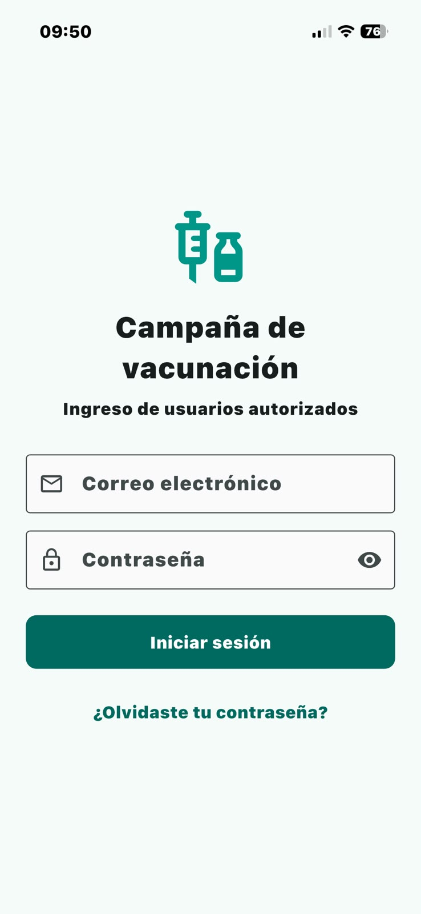
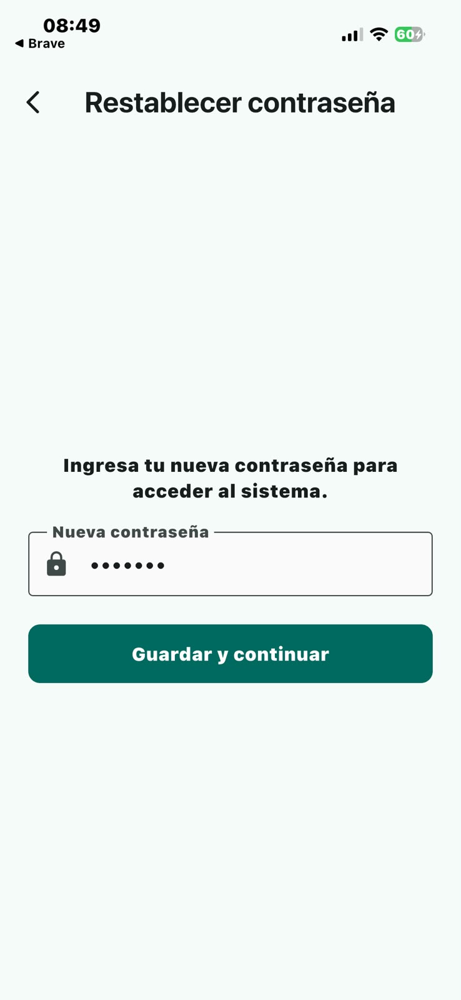
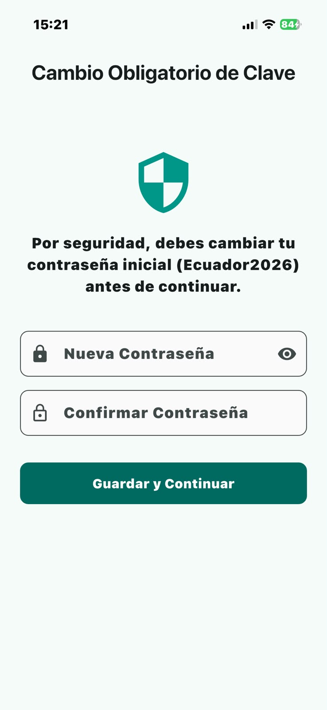
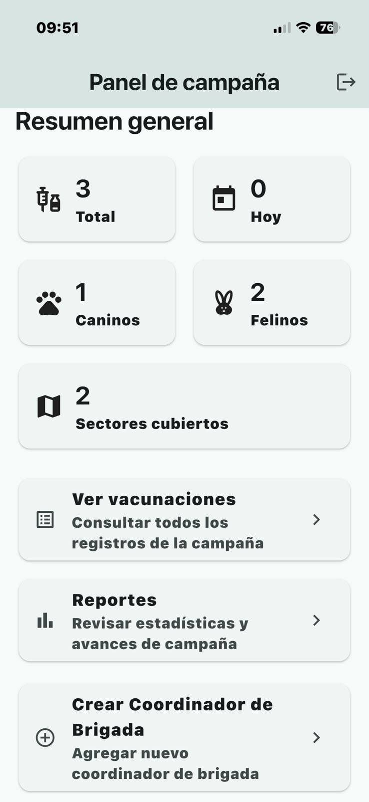
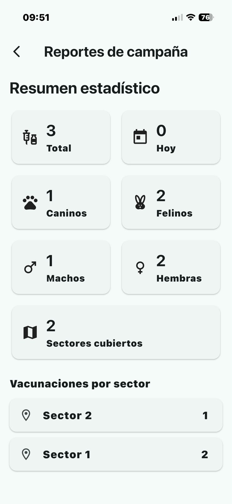
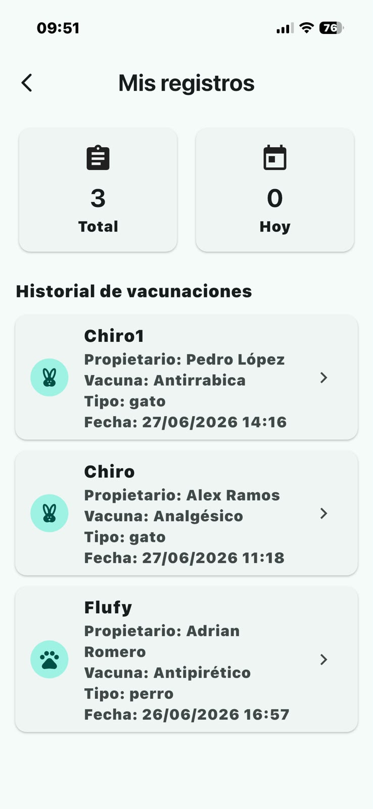
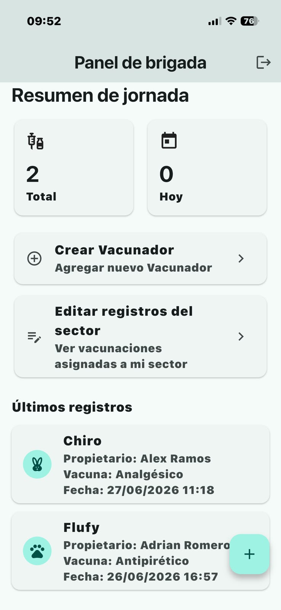
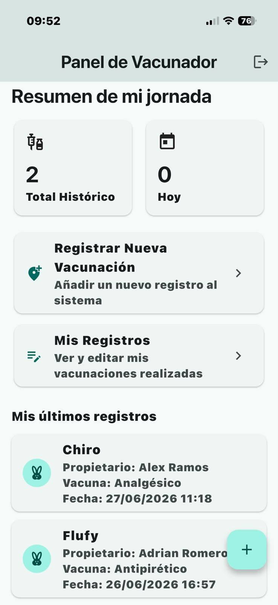
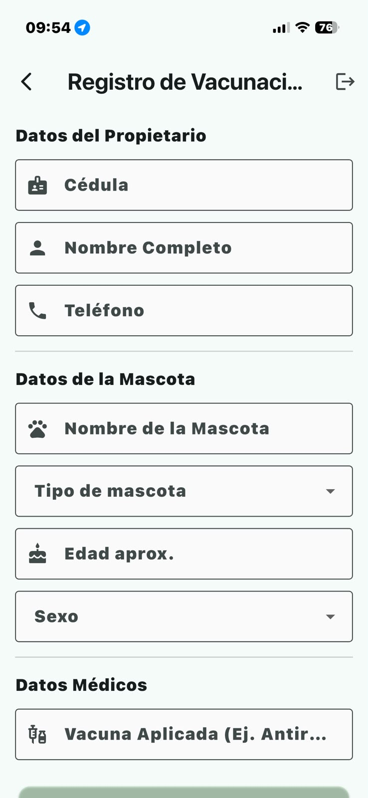
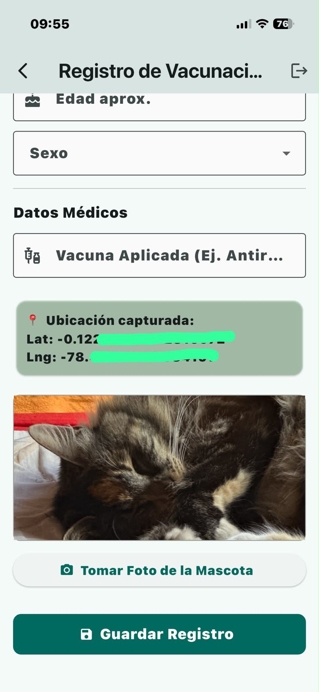

# 🐶🐱 Vacunación Mascotas Quito

Aplicación móvil desarrollada en Flutter para la gestión de campañas de vacunación canina y felina, implementada como parte de la asignatura Desarrollo de Aplicaciones Móviles de la carrera de Tecnología Superior en Desarrollo de Software.

La aplicación permite administrar campañas de vacunación mediante un sistema de roles jerárquicos, captura de fotografías, geolocalización GPS, funcionamiento offline y sincronización automática con la nube.

## 📋 Descripción del proyecto

Una entidad municipal requiere una aplicación móvil para gestionar campañas de vacunación de perros y gatos en distintos sectores de la ciudad.

El sistema implementa tres roles:

* Coordinador de campaña
* Coordinador de brigada
* Vacunador

Cada rol posee permisos específicos para la administración de usuarios, sectores y registros de vacunación.

## ✨ Funcionalidades implementadas

🔐 Autenticación y seguridad

* Inicio de sesión mediante Supabase Auth.
* Gestión de roles.
* Creación controlada de usuarios.
* Contraseña inicial automática:
``` bash
Ecuador2026
```

* Cambio obligatorio de contraseña en el primer acceso.
* Recuperación de contraseña mediante correo electrónico.
* Envío de enlaces de recuperación utilizando Supabase Auth.
* Validación de permisos según rol.

## 👨‍💼 Coordinador de campaña

* Crear sectores.
* Crear coordinadores de brigada.
* Asignar coordinadores a sectores.
* Visualizar dashboard general.
* Visualizar estadísticas globales.

## 👨‍⚕️ Coordinador de brigada

* Visualizar sectores asignados.
* Crear vacunadores.
* Asignar y reasignar vacunadores.
* Corregir registros de vacunación del sector.
* Visualizar dashboard del sector.

## 💉 Vacunador

* Visualizar únicamente sectores asignados.
* Registrar vacunaciones.
* Editar registros propios.
* Actualizar fotografías.
* Actualizar ubicación GPS.
* Trabajar en modo offline.
* Sincronización automática al recuperar conexión.

## 📍 Registro de vacunación

Cada registro almacena:

* Nombre del propietario
* Cédula del propietario
* Teléfono
* Tipo de mascota
* Nombre de la mascota
* Edad aproximada
* Sexo
* Vacuna aplicada
* Observaciones
* Fotografía
* Coordenadas GPS
* Fecha y hora
* Vacunador responsable
* Sector asignado

## 🏗 Arquitectura utilizada

El proyecto fue desarrollado siguiendo una arquitectura por capas:
``` bash
lib/
├── main.dart                  # Inicialización de Supabase y router
├── config/
│   ├── supabase_config.dart   # URL y Anon Key de Supabase
│   └── theme.dart             # Colores y estilos de Material 3
├── data/                      # CAPA DE DATOS (Modelos y llamadas a bases de datos)
│   ├── models/
│   │   ├── user_model.dart
│   │   └── vaccination_model.dart
│   ├── providers/             # Conexión directa a Supabase y Hive (Local)
│   │   ├── supabase_provider.dart
│   │   └── local_storage_provider.dart
│   └── repositories/          # Une la lógica remota y local (Offline First)
│       └── vaccination_repository.dart
├── presentation/              # CAPA DE INTERFAZ Y LÓGICA DE PANTALLA
│   ├── state/                 # Gestores de estado (Riverpod, Bloc o Providers)
│   │   ├── auth_provider.dart
│   │   └── sync_provider.dart
│   └── screens/               # Pantallas organizadas por flujos
│       ├── auth/
│       │   ├── login_screen.dart
│       │   └── change_password_screen.dart
│       ├── coordinator/
│       │   └── campaign_dashboard_screen.dart
│       ├── brigada/
│       │   └── brigada_dashboard_screen.dart
│       └── vacunador/
│           ├── register_vaccine_screen.dart
│           └── my_records_screen.dart
└── utils/                     # Helpers (Ubicación, cámara, validadores de cédula)
    ├── gps_helper.dart
    └── camera_helper.dart


```

Se aplicó separación entre:

* Interfaz de usuario
* Lógica de negocio
* Acceso a datos
* Persistencia local
* Sincronización

## ☁ Backend

El backend fue implementado utilizando Supabase:

Supabase Auth

* Login
* Recuperación de contraseña
* Cambio obligatorio de contraseña
* Gestión de usuarios

Supabase Database

* Almacenamiento relacional
* Gestión de roles
* Sectores
* Vacunaciones
* Dashboard

Supabase Storage

* Almacenamiento de fotografías de mascotas vacunadas

## 📡 Funcionamiento Offline

El sistema implementa persistencia local utilizando Hive.

Características:

* Registro de vacunaciones sin conexión.
* Almacenamiento local temporal.
* Detección automática de conectividad.
* Sincronización automática al recuperar internet.

## 📊 Dashboard

El sistema genera indicadores estadísticos:

* Total de vacunaciones.
* Total de perros vacunados.
* Total de gatos vacunados.
* Vacunaciones por sector.
* Vacunaciones por vacunador.
* Registros pendientes de sincronización.

## 📱 Hardware utilizado

La aplicación utiliza funcionalidades nativas de iOS:

Cámara

* Captura de fotografías de mascotas.

GPS

* Captura automática de coordenadas.

Almacenamiento local

* Persistencia offline.

Conectividad

* Detección automática de internet.

## 📦 Dependencias utilizadas

``` bash 
supabase_flutter
flutter_riverpod
image_picker
geolocator
connectivity_plus
hive_flutter
flutter_launcher_icons
flutter_native_splash
```

## ⸻

🔒 Permisos iOS utilizados

La aplicación solicita los siguientes permisos:

#### Cámara
``` bash
NSCameraUsageDescription
```

#### Galería
``` bash
NSPhotoLibraryUsageDescription
```

#### Ubicación GPS
``` bash
NSLocationWhenInUseUsageDescription
```

#### Deep Link para recuperación de contraseña

``` bash
CFBundleURLTypes
```

## 🍎 Configuración iOS

La aplicación fue diseñada específicamente para dispositivos iOS.

Características implementadas:

* Splash screen personalizado.
* Ícono personalizado.
* Archivo IPA para distribución.
* Deep Links para recuperación de contraseña.
* Permisos nativos configurados en Info.plist.

## 🛠 Tecnologías utilizadas

* Flutter
* Dart
* Supabase
* Riverpod
* Hive
* Geolocator
* Image Picker
* Connectivity Plus

## 🚀 Instalación

#### Clonar repositorio
``` bash
git clone https://github.com/WilmerRamos21/Flutter-Campana-Vacunacion.git
```

#### Instalar dependencias
``` bash
flutter pub get
```

#### Ejecutar aplicación
``` bash
flutter run
```

#### Generar IPA
Cabe recalcar que se debe contar con una cuenta de desarrollador de Apple para registrar el proyecto a su Team y generar el bundle para la instalacion de la app
``` bash
flutter build ipa
```

🔑 Credenciales de prueba

#### Coordinador de campaña
``` bash
Correo:
wilmerrc13@gmail.com

Contraseña:
123456
```

#### Coordinador de brigada
``` bash
Correo:
tabiged962@luxudata.com

Contraseña:
123456
```

#### Vacunador
``` bash
Correo: 
bgw67329@laoia.com

Contraseña:
123456
```

# 📸 Capturas del sistema

## Login


## Recuperación de Contraseña


## Cambio de Contraseña al inicio de sesión


## Dashboard Campaña


## Reporte de Dashboard Campaña


## Reporte de Registros


## Dashboard Brigada


## Dashboard Vacunador


## Registro de vacunación



## Registro de vacunación



## ⭐ Funcionalidades extra implementadas

✅ Persistencia offline

✅ Sincronización automática

✅ Actualización de fotografías

✅ Actualización de ubicación GPS

✅ Recuperación de contraseña por correo

✅ Cambio obligatorio de contraseña

✅ Dashboard por roles

✅ Control de permisos por sector

## Autor

### Wilmer Ramos

Tecnología Superior en Desarrollo de Software

Proyecto académico desarrollado para la asignatura de Desarrollo de Aplicaciones Móviles.
